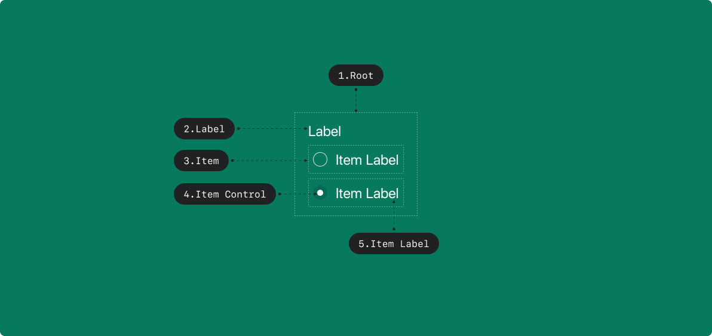

## Anatomy

<Anatomy></Anatomy>

1. Root
2. Label
3. Radio
4. Radio Control
5. Radio Label

## Root

### States

| State         | Values       | Default Value | Description                        |
| ------------- | ------------ | ------------- | ---------------------------------- |
| selectedValue | string, null | null          | 선택된 Radio의 Value, 없을 시 null |

### Contexts

| Context     | Values               | Default Value | Description                                               |
| ----------- | -------------------- | ------------- | --------------------------------------------------------- |
| isDisabled  | true, false          | false         | true일 경우, Radio Group 전체가 유저와 상호작용 하지 않음 |
| isReadonly  | true, false          | false         | true일 경우, selectedValue를 변경할 수 없음               |
| isRequired  | true, false          | false         | true일 경우, selectedValue가 필수임을 나타냄              |
| isInvalid   | true, false          | false         | true일 경우, selectedValue가 유효하지 않은 값임을 나타냄  |
| orientation | horizontal, vertical | vertical      | 키보드로 접근할 때 Radio들의 정렬 방향                    |

## Radio

### States

| State     | Values      | Default Value | Description                                    |
| --------- | ----------- | ------------- | ---------------------------------------------- |
| isHovered | true, false | false         | Radio 영역 내에 포인터가 존재할 시 true로 전환 |
| isFocused | true, false | false         | Radio에 Focus가 잡혀있을 때 true로 전환        |
| isPressed | true, false | false         | Radio 영역을 누르고 있을 때 true로 전환        |

### Contexts

| Context    | Values      | Default Value | Description                                   |
| ---------- | ----------- | ------------- | --------------------------------------------- |
| value      | string      |               |                                               |
| isDisabled | true, false | false         | true일 경우, Radio가 유저와 상호작용하지 않음 |

### Derived States

| State      | Values      | Statement                       | Description |
| ---------- | ----------- | ------------------------------- | ----------- |
| isDisabled | true, false | root.isDisabled \|\| isDisabled |             |
| isReadonly | true, false | root.isReadonly                 |             |
| isSelected | true, false | root.selectedValue == value     |             |

## Actions

| Action           | From | Condition                              | To                              |
| ---------------- | ---- | -------------------------------------- | ------------------------------- |
| SELECT(radio)    | -    | !radio.isDisabled && !radio.isReadonly | root.selctedValue = radio.value |
| FOCUS(radio)     | -    | !radio.isDisabled                      | radio.isFocused = true          |
| BLUR(radio)      | -    |                                        | radio.isFocused = false         |
| HOVER_IN(radio)  | -    | !radio.isDisabled                      | radio.isHovered = true          |
| HOVER_OUT(radio) | -    | !radio.isDisabled                      | radio.isHovered = false         |
| PRESS_IN(radio)  | -    | !radio.isDisabled                      | radio.isPressed = true          |
| PRESS_OUT(radio) | -    | !radio.isDisabled                      | radio.isPressed = false         |

## Triggers

### Web

| Part          | Event          | Action            |
| ------------- | -------------- | ----------------- |
| Radio         | PointerUp      | SELECT(radio)     |
| Radio         | PointerDown    | PRESS_DOWN(radio) |
| Radio         | PointerUp      | PRESS_UP(radio)   |
| Radio         | PointerOver    | HOVER_IN(radio)   |
| Radio         | PointerLeave   | HOVER_OUT(radio)  |
| Radio Control | Focus          | FOCUS(radio)      |
| Radio Control | Blur           | BLUR(radio)       |
| Radio Control | KeyUp(Space)   | SELECT(radio)     |
| Radio Control | KeyDown(Space) | PRESS_IN(radio)   |
| Radio Control | KeyUp(Space)   | PRESS_OUT(radio)  |

### iOS

| Part  | Event            | Action          |
| ----- | ---------------- | --------------- |
| Radio | `touchUpInside`  | `SELECT(radio)` |
| Radio | `touchUpOutside` | `SELECT(radio)` |
