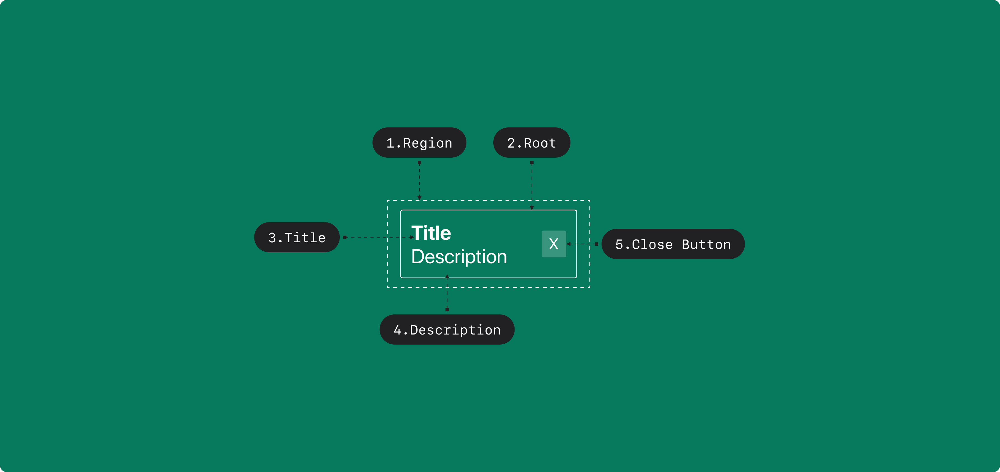

## Anatomy

<Anatomy></Anatomy>

1. Region
2. Snackbar
3. Title
4. Description
5. Close Button

## States

| State     | Values                                | Default Value |
| --------- | ------------------------------------- | ------------- |
| visiblity | inactive, persist, active, dismissing | inactive      |
| queue     | SnackbarOption[]                      | []            |

## Contexts

| State              | Values      | Default Value |
| ------------------ | ----------- | ------------- |
| pauseOnInteraction | false, true | true          |

## Actions

| Action  | From     | Condition | To         |
| ------- | -------- | --------- | ---------- |
| PUSH    | inactive |           | active     |
| DISMISS | active   |           | dismissing |
|         | persist  |           | dismissing |
| PAUSE   | active   |           | persist    |
| RESUME  | persist  |           | active     |

## Delays

| From       | Delay                  | Condition | To         |
| ---------- | ---------------------- | --------- | ---------- |
| active     | queue.head.timeout     |           | dismissing |
| dismissing | queue.head.removeDelay |           | inactive   |

## Entry Actions

| From     | Condition        | To     |
| -------- | ---------------- | ------ |
| inactive | queue.length > 0 | active |

## Triggers

| Part         | Event | Condition                    | Action  |
| ------------ | ----- | ---------------------------- | ------- |
| Snackbar     | Focus | `pauseOnInteraction == true` | PAUSE   |
| Snackbar     | Blur  |                              | RESUME  |
| Close Button | Press |                              | DISMISS |

## Interfaces

```
SnackbarOption {
    timeout: int
    removeDelay: int
}
```
