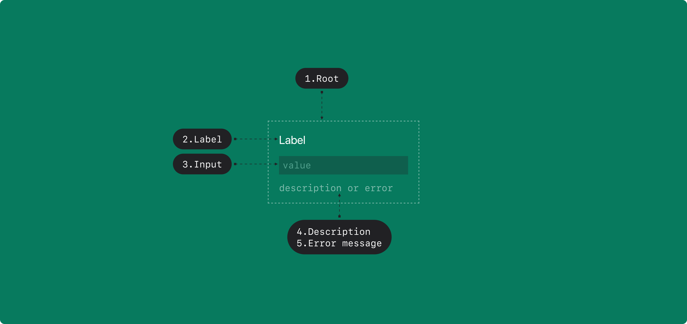

## Anatomy

<Anatomy>
  
</Anatomy>

1. Root
2. Label
3. Input
4. Description
5. Error message

## States

| State     | Values      | Default Value |
| --------- | ----------- | ------------- |
| value     | string      |               |
| isFocused | true, false | false         |

## Contexts

| Context    | Values       | Default Value | Description                                                 |
| ---------- | ------------ | ------------- | ----------------------------------------------------------- |
| isDisabled | true, false  | false         | true일 경우, Text field가 유저와 상호작용하지 않음          |
| isReadonly | true, false  | false         | true일 경우, value를 변경할 수 없음                         |
| isRequired | true, false  | false         | true일 경우, value가 필수임을 나타냄                        |
| isInvalid  | true, false  | false         | true일 경우, value가 유효하지 않은 값임을 나타냄            |
| maxLength  | number, null | null          | null이 아닌 경우, value의 길이는 maxLength를 초과할 수 없음 |

## Actions

| Action           | From               | Condition                    | To                 |
| ---------------- | ------------------ | ---------------------------- | ------------------ |
| TOGGLE           | isSelected = false | !isDisabled && !isReadonly   | isSelected = true  |
|                  | isSelected = true  | !isDisabled && !isReadonly   | isSelected = false |
| FOCUS            | isFocused = false  | !isDisabled                  | isFocused = true   |
| BLUR             | isFocused = true   |                              | isFocused = false  |
| SET_VALUE(value) | \*                 | value.length &lt;= maxLength | value = value      |

## Triggers

| Part  | Event | Action |
| ----- | ----- | ------ |
| Field | Focus | FOCUS  |
| Field | Blur  | BLUR   |
