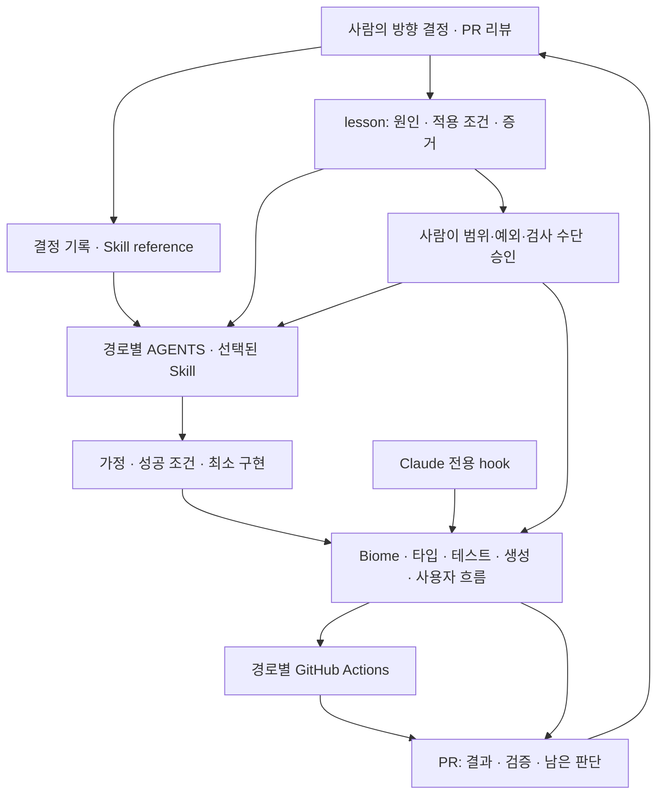

# SEED 개발 harness

[시각화](index.html)는 현재 저장소의 결정·지침·교훈·hook·CI를 연결한다. `skills/`와 `.agents/learnings/entries/`가 원천이며 별도 수동 목록을 유지하지 않는다. 화면은 설정과 연결을 보여주며 실제 호출·검사 통과를 의미하지 않는다.

## 현재 구조



- 결정은 현재 `skills/seed-component/references/architecture-decisions.md`와 일부 lesson 본문에 분산돼 있다. `decisions/`에는 신규 결정의 기록 절차와 템플릿을 추가했다. 기존 결정을 자동으로 이관하거나 새 팀 합의를 만들어내지 않는다.
- AGENTS는 작업 경로에 따라 지침을 선택한다. 세 스킬은 구현 전·중 Karpathy, 완료 전 Verification, 결과 전달 Attention Kind에 연결한다.
- Codex·Claude는 기존 symlink로 같은 `skills/`를 읽는다. `.claude/settings.json`의 hook은 Claude 전용이며 Codex 자동 실행을 보장하지 않는다.
- Claude의 생성물 guard는 `.gitattributes`를 읽고 수정을 막는다. 예외 처리에서는 조용히 허용하므로 모든 오류를 차단하는 게이트는 아니다.
- PostToolUse는 포맷·경로별 생성/빌드를 실행한다. Stop hook은 체크리스트 권고다. 성공 피드백의 exit 2 사용, `tool_response.filePath` 의존성은 별도 개선 후보이며 이번에 동작을 변경하지 않았다.
- CI는 경로와 이벤트에 따라 실행된다. 현재 workflow에는 저장소 전체 `biome check` 게이트가 없다. 경로별 테스트 성공으로 전체 lint·타입·기기 검증을 통과했다고 말하지 않는다.

## 결정·lesson을 강제 수단으로 바꾸는 절차

1. 재사용할 문제가 확인되면 기존 lesson에 원인·적용 조건·증거를 남긴다. 새 정책이나 공개 계약 변경이면 관련 결정 기록을 연결한다.
2. 담당자가 적용 경로, 위반 사례, 정상 사례, 허용 예외, 되돌릴 조건을 검토한다. 한 번의 개인 환경 오류나 미확정 추측을 자동으로 규칙으로 만들지 않는다.
3. 가장 작은 수단을 선택한다. 기존 Biome 규칙 → GritQL 구문 검사 → 타입·스키마·테스트 → 생성·빌드·기기 검증 → AGENTS·Skill·리뷰 순으로 표현 가능성을 검토한다. 뒤의 수단이 앞의 수단보다 열등하다는 뜻은 아니다.
4. 위반은 실패하고 정상·예외는 통과하는 fixture를 만든다. 현재 적용 경로 전체를 조사해 오탐과 기존 위반을 확인한다. 자동 수정은 동작 보존 근거가 있을 때만 추가한다.
5. 검증된 검사와 실행 명령을 동일 PR에 연결한다. 에디터 hook만 두지 않고 가능한 경우 공통 명령·CI에서도 실행한다. CI 추가 전에는 해당 이벤트·경로·권한·필수 검사 정책을 확인한다.
6. 사람이 PR을 승인하고 승격 대상이 생기면 lesson을 `promoted`로 바꾸고 `promoted_to`에 실제 경로를 기록한다. 조건·설명은 보존한다. 부분만 승격했다면 나머지는 활성 lesson으로 분리한다.
7. 다음 관련 PR에서 놓친 위반·오탐·검사 비용을 확인한다. 정책이 바뀌면 결정과 원천 검사를 함께 갱신하고 lesson 상태를 재검토한다.

승격 PR 본문은 `근거 lesson/결정 → 적용 범위·예외 → 강제 수단·명령 → 위반/정상 fixture → 기존 위반·검증 → 재검토 조건`을 담는다. 문서에만 규칙을 복사해 여러 원천을 만들지 않는다.

## Biome으로 표현할 후보

현재 설치 버전은 2.3.11이다. 최신 공식 문서의 모든 기능이 설치 버전에도 있다고 가정하지 않는다. 실제 스키마와 fixture 실행으로 확인한다.

| 근거·문제 | 가능한 수단 | 판단과 한계 |
| --- | --- | --- |
| TECH의 새 `any` 금지 | 기존 `noExplicitAny` | 현재 info이며 검사 실패를 강제하지 않는다. 타입 경계·생성물·기존 코드 예외를 확인한 뒤 신규 적용 범위를 결정한다. 이번에 severity를 바꾸지 않았다. |
| Headless·Styled 레이어의 의존성 경계 | `noRestrictedImports` + 경로별 override | 금지 패키지와 허용 type import를 사람이 먼저 확정한다. 기존 architecture 결정은 경계 판단의 근거이며 아직 새 lint 규칙은 아니다. |
| 반복되는 특정 호출·JSX 패턴 | GritQL 플러그인 | 구문만으로 판정할 수 있는 좁은 패턴에 적합하다. 설치 버전에서 플러그인 로드를 직접 확인한다. 정상/위반/alias/허용 예외를 검증한다. |
| Lynx `background only` lesson | 번들 산출물 비교·런타임 테스트 | 함수가 render 중 호출되는지, 두 thread에 어떤 본문이 남는지는 구문만으로 확정하지 않는다. 일괄 directive 추가를 lint 자동 수정으로 만들지 않는다. |

- `workspace-installation`: 실행 파일·workspace 링크의 준비 문제이므로 검증 preflight나 Skill 절차로 다룬다. Biome이 모듈 설치 성공을 증명하지 않는다.
- `lynx-headless-no-docs`: 분리 작업이라는 조건과 사람의 문서 정책이 필요하다. MDX 검사·문서 리뷰 지침 후보이며 전체 Headless 문서를 무조건 금지하는 JS lint 규칙으로 바꾸지 않는다.
- 생성물 직접 편집 방지는 기존 `.gitattributes`·guard를 사용한다. 강화한다면 공통 검사에서 원천 재생성과 diff를 비교한다. 코드 구문 검사로 대체하지 않는다.

Biome는 [GritQL 플러그인](https://biomejs.dev/linter/plugins/)을 지원한다. JS 플러그인을 그대로 로드하는 구조가 아니다. 이 저장소 2.3.11의 `plugins` 스키마는 문자열 경로 배열이며 최신 문서의 `path`·`includes` 객체 설정과 다르다. 현재 버전에서는 root/override 설정을 실제 검증한 뒤 범위를 선택한다. [noRestrictedImports](https://biomejs.dev/linter/rules/no-restricted-imports/)도 설치된 옵션으로 확인한다.

로컬 2.3.11의 격리된 GritQL fixture에서 정상 호출은 exit 0, 금지 패턴은 plugin 진단 1건·exit 1을 확인했다. 플러그인 로드 기능의 확인이며 SEED 도메인 규칙을 설치·활성화한 것은 아니다.

## 시각화 갱신·검증

```sh
bun scripts/harness-map.ts
bun scripts/harness-map.ts --check
bun test scripts/harness-map.test.ts
```

- 생성 명령은 현재 tracked·untracked 파일 목록에서 lesson frontmatter, AGENTS·Skill·decision·workflow 경로, Claude hook 설정만 읽는다. 비밀 값이나 `.env`는 읽지 않는다.
- `harness/index.html`은 생성물이다. 직접 고치지 않고 generator를 고친다. lesson 검색·상태 필터·승격 대상 링크로 적용 범위와 현재 연결을 확인한다.
- decision·lesson·Skill·hook·CI 구조가 바뀐 PR은 시각화를 재생성하고 `--check`로 오래된 결과를 확인한다. [harness-map CI](../.github/workflows/harness-map.yml)는 관련 PR과 dev push에서 테스트·lint·타입·최신 여부를 검사한다. CI 설정과 실제 원격 실행·통과, 에이전트 자동 선택은 구분한다.
- HTML은 로컬 파일로 열거나 저장소 루트에서 `python3 -m http.server`를 실행해 `/harness/`로 본다. 링크는 저장소 상대 경로이며 HTML과 저장소를 함께 두어야 한다.

첫 개선 후보는 공통 생성물 guard 검증, Claude hook 입력·종료 코드 계약 테스트, 범위가 확정된 import 경계 검사다. 모두 별도 동작 변경 PR에서 fixture와 기존 위반 조사를 포함해 진행한다.
