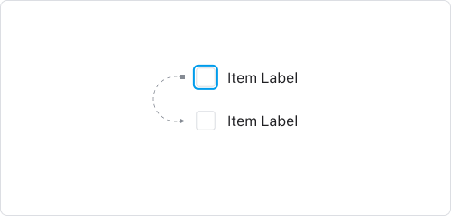
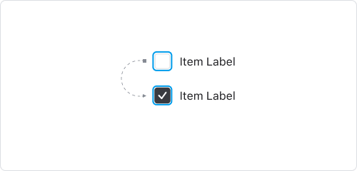
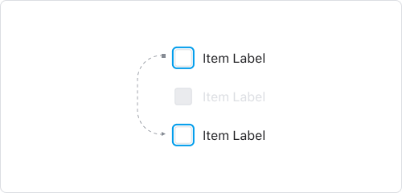

# Checkbox

<TitleDescription>

최소 1가지 이상의 옵션을 선택 또는 해제할 수 있는 컨트롤입니다.

</TitleDescription>

## Anatomy

1. Root : 체크박스 컴포넌트를 감싸는 최소단위 컨테이너 영역
2. Control : 체크박스의 상태를 나타내는 시각 요소
3. Label : 체크박스에 대한 정보를 전달하는 라벨

## States & Options

State : 컴포넌트 자체가 가지는 상태값 
Option : 컴포넌트에 영향을 주는 외부 상황에 의해 결정되는 상태값

<Table>
	<TableHead>
		<TableRow>
			<TableData>State</TableData>
			<TableData>Value</TableData>
			<TableData>Description</TableData>
		</TableRow>
	</TableHead>
	<TableBody>
		<TableRow>
			<TableData>Checked</TableData>
			<TableData>True / False</TableData>
			<TableData>Checkbox가 체크된 상태일 때 True로 전환</TableData>
		</TableRow>
		<TableRow>
			<TableData>Hovered</TableData>
			<TableData>True / False</TableData>
			<TableData>PC환경에서 마우스 오버 상태일 때 True로 전환</TableData>
		</TableRow>
		<TableRow>
			<TableData>Pressed</TableData>
			<TableData>True / False</TableData>
			<TableData>마우스 또는 터치로 클릭 중인 상태일 때 True로 전환</TableData>
		</TableRow>
		<TableRow>
			<TableData>Focused</TableData>
			<TableData>True / False</TableData>
			<TableData>Checkbox 영역을 인식하고 상호작용하고 있는 상태일 때 True로 전환</TableData>
		</TableRow>
	</TableBody>
</Table>

<Table>
	<TableHead>
		<TableRow>
			<TableData>Option</TableData>
			<TableData>Value</TableData>
			<TableData>Description</TableData>
		</TableRow>
	</TableHead>
	<TableBody>
		<TableRow>
			<TableData>Disabled</TableData>
			<TableData>True / False</TableData>
			<TableData>True일 경우, Checkbox가 제어불가능한 상태. Focused state가 작동하지 않음</TableData>
		</TableRow>
		<TableRow>
			<TableData>Indeterminate</TableData>
			<TableData>True / False</TableData>
			<TableData>True일 경우, Checked 여부를 결정할 수 없음을 나타냄</TableData>
		</TableRow>
		<TableRow>
			<TableData>Invalid</TableData>
			<TableData>True / False</TableData>
			<TableData>True일 경우, 유효하지 않은 값임을 나타냄</TableData>
		</TableRow>
		<TableRow>
			<TableData>Read Only</TableData>
			<TableData>True / False</TableData>
			<TableData>True일 경우, Checkbox가 제어불가능한 상태이나 Focused state는 작동하는 상태</TableData>
		</TableRow>
	</TableBody>
</Table>

## Behaviors

### Keyboard

<Card>
	<CardImageCell>
		
	</CardImageCell>
	<CardDescriptionCell>
		<CardTitle>Focus</CardTitle>
		<CardDescription>
			<Keyboard>tab</Keyboard> 키를 통해 포커스를 다음 Checkbox로 옮길 수 있습니다
		</CardDescription>
	</CardDescriptionCell>
</Card>

<Card>
	<CardImageCell>
		
	</CardImageCell>
	<CardDescriptionCell>
		<CardTitle>Checked ON/OFF</CardTitle>
		<CardDescription>
			<Keyboard>←</Keyboard><Keyboard>→</Keyboard> 키를 통해 Tab item에 Focus 이동 시
			Contents가 전환되지 않습니다. Tab item에 Focus된
			상태에서 <Keyboard>space</Keyboard><Keyboard>↩</Keyboard> 키를 통해 해당 Tab item의
			Contents로 전환할 수 있습니다.
		</CardDescription>
	</CardDescriptionCell>
</Card>

<Card>
	<CardImageCell>
		
	</CardImageCell>
	<CardDescriptionCell>
		<CardTitle>Disabled</CardTitle>
		<CardDescription>
			포커스 이동시 Disabled상태인 Checkbox는 인식하지 않습니다
		</CardDescription>
	</CardDescriptionCell>
</Card>

<Card>
	<CardImageCell>
		
	</CardImageCell>
	<CardDescriptionCell>
		<CardTitle>Indeterminate</CardTitle>
		<CardDescription>
			Checkbox가 Indeterminate 상태일 경우
			<Keyboard>space</Keyboard> 키를 통해 Checked False로 전환합니다
		</CardDescription>
	</CardDescriptionCell>
</Card>
